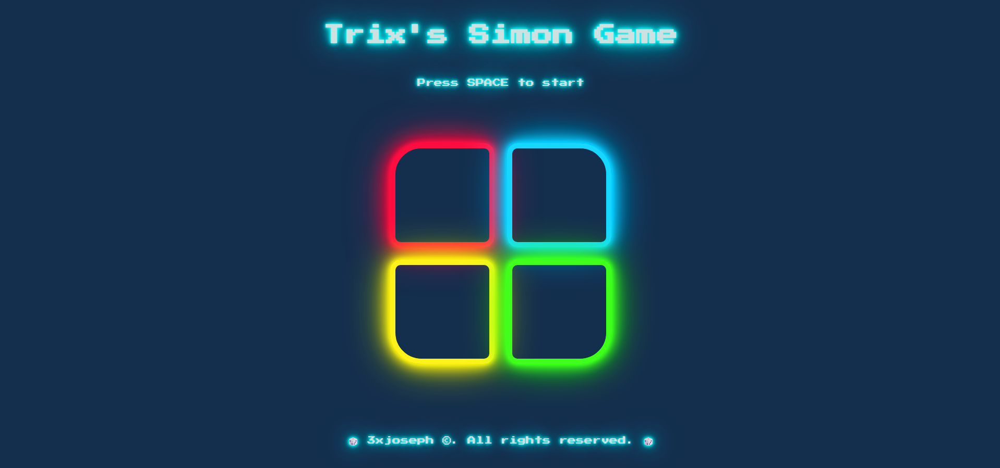

# 🎮 Trix's Simon Game

Trix's Simon Game is a web-based memory challenge inspired by the classic "Simon Says" game. Test how long you can remember and repeat an ever-growing sequence of colors and sounds!

 <!-- Optional: Replace with actual image or remove -->

## 🛠️ Tech Stack

- **HTML5** – Structure of the game.
- **CSS3** – Custom styling for layout and animations.
- **Bootstrap** – Responsive design and UI components.
- **jQuery** – DOM manipulation and game logic.

## 🚀 Features

- 🔊 Interactive color and sound sequence.
- 🧠 Progressive difficulty with each level.
- 📱 Responsive design — play on mobile or desktop.
- 🎨 Clean UI with Bootstrap for quick loading.

## 🕹️ How to Play

1. **Start the game** by pressing the SPACE key.
2. **Watch the pattern** of lights and sounds.
3. **Repeat the pattern** by clicking the buttons in the same order.
4. The sequence increases each round — see how far you can go!
5. Make a mistake? Game over — but you can always try again.
